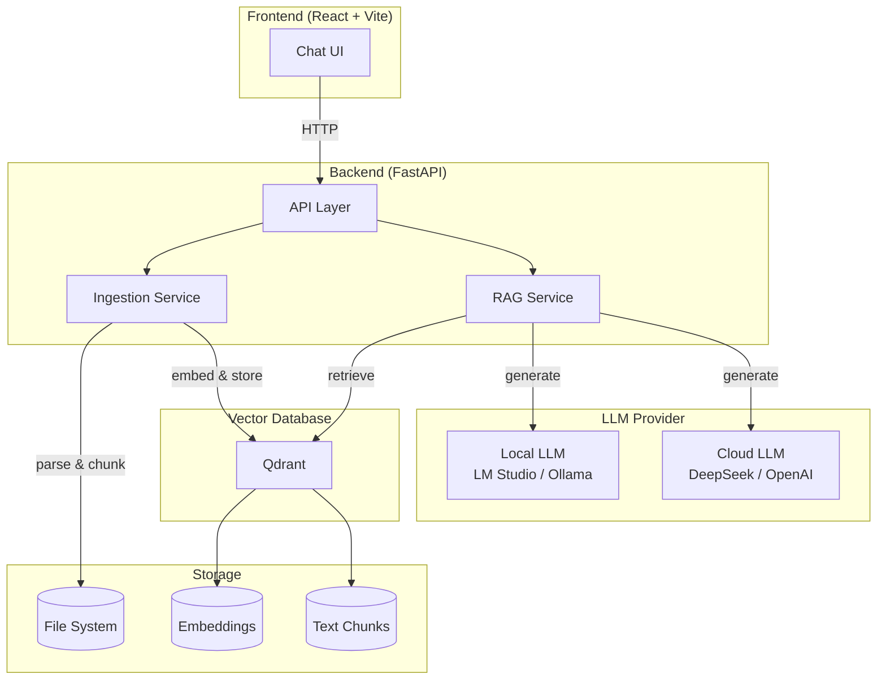

# 🧠 Local RAG System

> **本地的智能助手** — 基于 RAG（检索增强生成）的企业级知识问答系统，完全运行在你的本地环境中，数据安全无忧。

[](https://www.python.org/)
[](https://fastapi.tiangolo.com)
[](https://langchain.com)
[](https://qdrant.tech)
[](https://react.dev)
[](LICENSE)

---

## ✨ 核心功能

| 功能 | 说明 |
|------|------|
| 📄 **文档上传与索引** | 支持 PDF、TXT、Markdown 格式，自动切分并生成向量索引 |
| 🔎 **智能检索与问答** | 基于 LLM + 向量检索，提供带来源引用的高质量回答 |
| 🔌 **灵活的后端模型** | 支持本地 LLM（LM Studio / Ollama）与云端 API（DeepSeek 等）无缝切换 |
| 🎨 **现代化聊天 UI** | 类似 ChatGPT 的交互界面，支持实时状态、来源查看、Top-K 调节 |
| 🐳 **一键 Docker 部署** | 向量数据库 Qdrant 通过 Docker Compose 快速启动，后端 Python 原生运行 |

---

## 🏗️ 系统架构



### 工作流程

1. **文档上传** → 后端解析文件 → 文本分块 → 生成向量嵌入 → 存入 Qdrant
2. **用户提问** → 向量检索 Top-K 相关片段 → 构建 Prompt → LLM 生成答案 → 返回带来源的回复

---

## 🚀 快速开始

### 环境要求

- Python 3.10+
- Node.js 18+ & npm
- Docker & Docker Compose（用于 Qdrant）
- 本地 LLM 运行环境（可选，推荐 LM Studio 或 Ollama）

### 1. 克隆并安装后端

```bash
git clone <your-repo-url>
cd local-rag-system

# 创建虚拟环境
python -m venv venv
source venv/bin/activate  # Linux/Mac
# 或 venv\Scripts\activate  (Windows)

pip install -r requirements.txt
```

### 2. 启动 Qdrant 向量数据库

```bash
docker compose up -d
```

### 3. 配置环境变量

复制 `.env.example` 为 `.env`，按需修改配置：

```env
# LLM 提供商: local / cloud
LLM_PROVIDER=local

# 本地 LLM 设置
LLM_BASE_URL=http://127.0.0.1:1234/v1
LLM_MODEL=qwen/qwen3-v1-8b
LLM_API_KEY=lm-studio

# Embedding 模型（LM Studio 兼容）
EMBEDDING_BASE_URL=http://127.0.0.1:1234/v1
EMBEDDING_MODEL=text-embedding-bge-small-zh-v1.5
EMBEDDING_API_KEY=lm-studio

# Qdrant 连接
QDRANT_URL=http://127.0.0.1:6333
QDRANT_COLLECTION=local_rag_docs
```

> **提示**：若使用云端 LLM（如 DeepSeek），将 `LLM_PROVIDER=cloud` 并配置 `CLOUD_LLM_*` 相关字段。

### 4. 启动后端服务

```bash
uvicorn app.main:app --reload --host 0.0.0.0 --port 8000
```

### 5. 启动前端

```bash
cd frontend
npm install
npm run dev
```

浏览器打开 `http://localhost:5173`，即可开始使用。

---

## 📂 项目结构

```
local-rag-system/
├── app/                    # 后端 Python 代码
│   ├── api/                # FastAPI 路由 ( health, documents, rag )
│   ├── core/               # 配置 & 日志
│   ├── llm/                # LLM 对接层 ( 本地 / 云端 )
│   ├── rag/                # RAG 核心 ( 加载, 分割, 嵌入, 检索, 链 )
│   ├── schemas/            # Pydantic 数据模型
│   ├── services/           # 业务逻辑 ( 文档, 摄取, RAG )
│   ├── utils/              # 工具函数 ( 文件, ID )
│   └── main.py             # FastAPI 应用入口
├── frontend/               # React + Vite 前端
│   ├── src/
│   │   ├── App.jsx         # 主聊天界面
│   │   ├── api.js          # 后端 API 封装
│   │   └── ...
│   └── package.json
├── docker/                 # Dockerfile
├── data/                   # 数据集 ( raw / processed )
├── docs/                   # 文档 ( 架构, API 设计 )
├── scripts/                # 辅助脚本 ( 数据摄入, 清库 )
├── tests/                  # 单元测试
├── docker-compose.yml      # Qdrant 容器编排
├── requirements.txt        # Python 依赖
└── .env.example            # 环境配置模板
```

---

## 📡 API 文档

| 方法 | 路径 | 描述 | 请求体 | 响应 |
|------|------|------|--------|------|
| `GET` | `/health` | 健康检查 | — | `{"status":"ok"}` |
| `POST` | `/documents/upload` | 上传文档并索引 | `multipart/form-data` (file) | `{"message":"...", "filename":"...", "chunks": int}` |
| `POST` | `/rag/query` | 基于知识库提问 | `{"question":"...", "top_k": 4}` | `{"answer":"...", "sources":[...]}` |

> 详细 API 设计请参见 [docs/api_design.md](./docs/api_design.md)

---

## 🛠️ 技术栈

| 层级 | 技术 | 用途 |
|------|------|------|
| **后端框架** | FastAPI + Uvicorn | 高性能异步 API |
| **AI 框架** | LangChain + LangGraph | RAG 流程编排 |
| **本地 LLM** | LM Studio / Ollama (OpenAI 兼容 API) | 推理 |
| **云端 LLM** | DeepSeek / OpenAI | 替代推理源 |
| **向量数据库** | Qdrant | 语义检索 |
| **嵌入模型** | BGE (via LM Studio) | 文本向量化 |
| **前端** | React 19 + Vite + Axios | 聊天界面 |
| **容器化** | Docker + Docker Compose | Qdrant 部署 |

---

