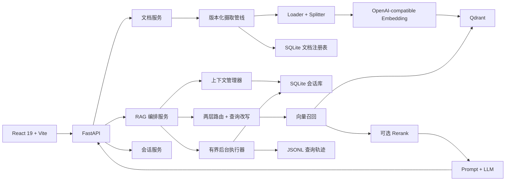

# Local RAG System

一个面向个人知识库的 local-first RAG 全栈项目：文档经过解析、分块和向量化写入 Qdrant，查询经过路由、改写、检索、可选精排和统一上下文预算后，由本地或云端 OpenAI-compatible 模型生成带来源的回答。

这个仓库不只包含演示页面，还包含版本化增量摄取、服务端长期记忆、SSE 流式协议、离线检索评估、自动化测试、CI 和容器部署配置。默认配置适合单机、单用户和可信局域网；它不是开箱即用的多租户 SaaS。

## 当前能力

| 方向 | 已实现 | 关键边界 |
|---|---|---|
| 文档摄取 | PDF、TXT、MD、Markdown、DOCX；批量 embedding；Qdrant 批量写入 | 暂无 OCR、表格结构恢复和图片理解 |
| 增量更新 | 稳定 `document_id`、内容 MD5、管线指纹、版本化 point ID、新版本先写、原子激活、持久化队列清旧 | Qdrant 与 SQLite 之间是补偿式一致性，不是分布式事务 |
| 文档管理 | 列表、按稳定 ID 删除、旧 `source` 兼容、同名冲突返回 409 | 列表需要 scroll 全部 metadata，超大库应改为独立目录表 |
| 查询路由 | Layer 0 正则快速回复；Layer 1 LLM 结构化路由、意图识别和查询改写 | 路由仍受模型质量影响，异常时 fail-open 到 RAG |
| 检索与精排 | Qdrant 向量召回；可选 Cross-Encoder 或 Hybrid Fusion | Rerank 默认关闭；启用后必须用评估证明收益 |
| 对话上下文 | SQLite 原文、滚动摘要、近期原文、客户端尾部对账、统一 token 预算 | 离线 tokenizer 是保守估算，不等于模型原生 tokenizer |
| 流式输出 | SSE routing/status/token/sources/error/done；阻塞阶段移出事件循环 | SSE 开始后不能再修改 HTTP 状态码 |
| 可靠性 | 有界后台线程池、SQLite WAL/busy timeout、turn 幂等、JSONL 写锁、请求 ID | 后台持久化和日志是 best-effort；没有外部任务队列 |
| 安全 | 安全配置默认值、请求长度限制、上传大小/内容校验、提示词注入边界、可选 API Key | API Key 只适合简单边界保护，不替代用户体系、JWT、RBAC 或限流 |
| 质量保障 | 160 项离线测试、前端 lint/build、GitHub Actions、评估报告 provenance | 真实 Qdrant/模型 E2E、浏览器自动化和负载测试仍需补充 |

## 架构


```mermaid
flowchart LR
    UI["React 19 + Vite"] --> API["FastAPI"]
    API --> DOC["文档服务"]
    API --> RAG["RAG 编排服务"]
    API --> CONV["会话服务"]

    DOC --> INGEST["版本化摄取管线"]
    INGEST --> LOAD["Loader + Splitter"]
    LOAD --> EMBED["OpenAI-compatible Embedding"]
    EMBED --> QD["Qdrant"]
    INGEST --> REG["SQLite 文档注册表"]

    RAG --> MEM["上下文管理器"]
    MEM --> CONVDB["SQLite 会话库"]
    RAG --> ROUTE["两层路由 + 查询改写"]
    ROUTE --> RETRIEVE["向量召回"]
    RETRIEVE --> QD
    RETRIEVE --> RERANK["可选 Rerank"]
    RERANK --> GENERATE["Prompt + LLM"]
    GENERATE --> API

    RAG --> BG["有界后台执行器"]
    BG --> CONVDB
    BG --> TRACE["JSONL 查询轨迹"]
```

系统有三条核心链路：

1. 摄取链路：扫描或上传 → 内容校验 → 加载 → 分块 → 批量 embedding → 新版本写入 Qdrant → SQLite 原子激活新版本并登记清理任务 → 幂等清理旧版本。
2. 查询链路：恢复会话 → 预算路由上下文 → 路由/改写 → 向量召回 → 可选精排 → 预算生成上下文 → LLM 生成 → 返回来源。
3. 完成后链路：完整回答生成后，使用有界线程池异步保存会话、压缩旧记忆并写入查询轨迹；失败或取消的流不会保存半截回答。

更详细的模块与时序说明见 [架构文档](docs/architecture.md)，HTTP 契约见 [API 设计](docs/api_design.md)。

## 上下文是怎么处理的

服务端是模型上下文的权威来源。请求中的 `history` 只用于弥补“浏览器已经收到上一轮结果，但后台 SQLite 尚未落库”的短暂竞态。

一次请求会按以下顺序处理：

1. 根据 `conversation_id` 读取滚动摘要和摘要游标之后的原始消息。
2. 使用最长重叠匹配，把客户端尾部中尚未持久化的消息补到服务端历史，避免重复。
3. 路由阶段先扣除路由输出预留和安全余量，再从新到旧选择历史。
4. 生成阶段统一计算 system prompt、当前问题、摘要、近期消息、检索文档、输出预留和安全余量。
5. 优先保留最新完整消息和排名靠前的文档；最后一条超长消息或最后一个文档块可确定性截断。
6. 当前问题本身都无法装入窗口时，同步接口返回 413，SSE 返回 `phase=context` 的 error 后结束。
7. 对话足够长时，旧消息被异步压缩为滚动摘要；完整原文仍保留在 SQLite 中用于 UI 和审计。

核心预算关系：

```text
可用输入 tokens
= LLM_CONTEXT_WINDOW
- LLM_RESERVED_OUTPUT_TOKENS
- CONTEXT_SAFETY_MARGIN_TOKENS
```

默认 `CONTEXT_TOKENIZER_ENCODING=offline_multilingual` 不依赖网络，并对中文做保守计数。它的目标是避免溢出，不是精确复刻 Qwen、DeepSeek 等模型的 tokenizer。

## 文档增量更新为什么不会先删坏数据

每个逻辑文档都有稳定 `document_id`。版本由以下信息共同决定：

```text
version_id = hash(document_id + content_md5 + pipeline_fingerprint)
```

`pipeline_fingerprint` 包含 collection、embedding endpoint/model/revision、chunk size、overlap 和 splitter 版本。因此内容没变但切分或 embedding 配置变了，也会触发重建。

替换流程是：

```text
加载/切分/embedding
        ↓
同步写入新 version points
        ↓
SQLite 原子激活新 version
并持久化旧 version 清理任务
        ↓
幂等删除旧 version points
并完成清理任务
        ↓
上传替换时删除旧 UUID 文件
```

在加载、embedding 或新版本 upsert 失败时，旧版本不会先被删除；SQLite 激活事务失败时，已写入的新版本会按精确的 `document_id + version_id` 回滚。激活成功但旧版清理失败时，新版保持可用，SQLite 的 durable cleanup queue 保留任务，后续摄取会幂等重试；响应用 `cleanup_pending` 明确这一状态。现有 collection 的向量维度也会在 upsert 前校验，避免切换 embedding 后写入一半才失败。

目录摄取还会把“本次扫描中已经消失、且注册路径确实位于该扫描根目录内”的文档从 Qdrant 和注册表中清理，防止越界误删。

## 快速开始

### 环境要求

- Python 3.11
- Conda 环境 `localrag`（仓库开发约定）
- Node.js 22
- Docker / Docker Compose
- 一个提供 OpenAI-compatible API 的 LLM 服务和 embedding 服务，例如 LM Studio 或 Ollama；也可把 LLM 切换到云端

### 1. 配置

```bash
conda activate localrag
pip install -r requirements.txt
cp .env.example .env

cd frontend
npm ci
cp .env.example .env
cd ..
```

至少确认这些值与实际加载的模型一致：

```dotenv
LLM_PROVIDER=local
LLM_BASE_URL=http://127.0.0.1:1234/v1
LLM_MODEL=qwen3-8b-mlx

EMBEDDING_BASE_URL=http://127.0.0.1:1234/v1
EMBEDDING_MODEL=text-embedding-qwen3-embedding-4b
EMBEDDING_REVISION=

QDRANT_URL=http://127.0.0.1:6333
QDRANT_COLLECTION=local_rag_docs
```

如果同一个 `EMBEDDING_MODEL` 名称背后的权重或量化版本变了，请修改 `EMBEDDING_REVISION`，让摄取管线知道向量语义已经变化。

### 2. 启动依赖与应用

```bash
# Qdrant
docker compose up -d

# 后端
conda activate localrag
uvicorn app.main:app --reload --host 0.0.0.0 --port 8000

# 前端（另一个终端）
cd frontend
npm run dev
```

打开 `http://127.0.0.1:5173`。

检查：

```bash
curl http://127.0.0.1:8000/health
curl http://127.0.0.1:8000/health/ready
```

`/health` 只表示进程存活；`/health/ready` 会检查 Qdrant、LLM endpoint 和 embedding endpoint，任何依赖不可达时返回 503。

### 3. 摄取文档

Web UI 支持上传，也可以批量扫描目录：

```bash
conda activate localrag
python ingest.py --input_dir data/engineering --batch_size 64
```

重复运行时，内容与管线指纹都未变化的文档会跳过；目录中被删除的文件会在安全根目录检查后同步清理。

如果 embedding 维度改变，现有 Qdrant collection 无法混用新旧维度。可以改用新 collection，或先清理旧 collection：

```bash
python scripts/clear_qdrant.py
python ingest.py --input_dir data/engineering --batch_size 64
```

只有在“手动清了 Qdrant，但内容和摄取配置完全没变”的情况下，才需要同时移除 `data/ingestion_state.db`，否则注册表会正确地认为该版本已经摄取：

```bash
python scripts/clear_qdrant.py
rm -f data/ingestion_state.db
```

## API

| 方法 | 路径 | 说明 |
|---|---|---|
| `GET` | `/` | 服务信息 |
| `GET` | `/health` | liveness |
| `GET` | `/health/ready` | Qdrant、LLM、embedding readiness |
| `POST` | `/documents/upload` | 单文件上传；默认上限 25 MiB |
| `POST` | `/documents/upload-batch` | 顺序处理多文件，逐文件返回结果 |
| `GET` | `/documents` | 列出索引中的逻辑文档及 `document_id` |
| `DELETE` | `/documents/{identifier}` | 优先按 `document_id` 删除；旧 source 仅在无歧义时兼容 |
| `POST` | `/rag/query` | 完整 JSON 问答 |
| `POST` | `/rag/query/stream` | SSE 流式问答 |
| `GET` | `/conversations` | 会话列表 |
| `GET` | `/conversations/{id}` | 会话详情 |
| `DELETE` | `/conversations/{id}` | 删除会话 |

### 查询请求

```json
{
  "question": "这个项目如何处理超长上下文？",
  "conversation_id": "conversation-1",
  "history": [],
  "force_rag": false
}
```

- `question`：1–20000 字符。
- `conversation_id`：1–64 位字母、数字、下划线或连字符；为空时创建新会话。
- `history`：最多 100 条，只允许 `user` / `assistant`；用于服务端落库竞态对账。
- `force_rag`：强制走知识库检索；前端的 `@rag` 前缀会设置它。

成功响应：

```json
{
  "question": "这个项目如何处理超长上下文？",
  "answer": "服务端会先统一计算输入预算……",
  "sources": [
    {
      "content": "...",
      "source": "architecture.md",
      "file_name": "architecture.md",
      "file_path": "docs/architecture.md",
      "chunk_index": 2,
      "page": null,
      "score": 0.82
    }
  ],
  "conversation_id": "conversation-1",
  "routing": "rag"
}
```

`routing` 为 `greeting`、`direct` 或 `rag`。

`sources[].score` 是当前策略的排序分数：vector-only、Cross-Encoder 和 Hybrid 的量纲不一定一致，只适合在同一策略/配置内比较顺序，前端不会用统一阈值把它标成“高/中/低相关”。

### SSE 事件

正常路径：

```text
routing → status* → token* → sources → done
```

失败路径：

```text
[routing] → [status*] → error → done
```

`error.data.phase` 可能是 `context`、`routing`、`retrieval`、`rerank` 或 `generation`。错误文本对客户端做了泛化，内部异常只记录在服务端日志。流被取消或生成失败时，不会把部分回答保存为完整会话。

### 可选 API Key

在后端 `.env` 配置：

```dotenv
APP_API_KEY=replace-with-a-random-secret
```

除 `/`、`/health` 和 `/health/ready` 外，请求需要：

```http
X-API-Key: replace-with-a-random-secret
```

前端对应设置 `VITE_API_KEY`。注意：Vite 变量会编译进浏览器产物，因此它只能作为简单的本地/内网共享口令，不能作为真正的用户密钥管理方案。

使用 `docker compose --profile full` 时，在仓库根目录的 `.env` 中同时设置 `APP_API_KEY` 和相同的 `VITE_API_KEY`；后者会作为 build arg 写入浏览器 bundle。单独运行 Vite 时，则在 `frontend/.env` 中设置 `VITE_API_KEY`。

## Rerank

默认关闭：

```dotenv
RERANKER_TYPE=none
```

可选策略：

- `cross_encoder`：进程内通过 `sentence-transformers` 懒加载 Cross-Encoder；不是由 LM Studio 执行。模型加载或预测失败会退回按原始向量分数排序。
- `hybrid`：对原始向量分数归一化，再与英文 token/CJK bigram 覆盖分数按 `alpha=0.7` 融合，无额外模型推理。

```dotenv
RERANKER_TYPE=cross_encoder
RERANKER_MODEL=BAAI/bge-reranker-base
RERANKER_CANDIDATE_TOP_N=20
RERANKER_FINAL_TOP_K=5
RERANKER_DEVICE=cpu
RERANKER_TRUST_REMOTE_CODE=false
```

系统先召回 `candidate_top_n`，再保留 `final_top_k`。不要把“存在 Rerank 模块”表述为“线上指标一定提升”；应运行同一 golden dataset 的对照实验。

## 检索评估

CLI 复用生产 retriever，可选 query processor 和 reranker：

```bash
conda activate localrag
python evaluation/run_retrieval_eval.py \
  --dataset evaluation/datasets/golden_retrieval.example.jsonl \
  --top-k 5 \
  --experiment-name vector-baseline

python evaluation/run_retrieval_eval.py \
  --dataset evaluation/datasets/golden_retrieval.example.jsonl \
  --top-k 5 \
  --use-query-processor \
  --use-reranker \
  --reranker-type hybrid \
  --rerank-top-n 20 \
  --experiment-name qp-hybrid
```

当前指标语义为 `evidence-label-v2`：

- Recall 的分母是完整 golden evidence 集合，未命中的标注不会从分母消失。
- Precision 按 top-k 检索槽位计算，同一 evidence 的重复 chunk 不会重复加分。
- MRR 保留首个相关证据的真实检索 rank。
- NDCG 保留噪声与重复结果占据的原始 rank，并支持分级相关性。
- context quality 继续在 chunk 层统计无关率、重复率和综合冗余。

CLI 与 Notebook 报告都记录 dataset SHA-256、Git SHA/dirty 状态、检索配置快照和 settings/pipeline fingerprint。旧报告如果没有 `metric_semantics_version: evidence-label-v2`，不能与新结果直接比较；Notebook 第 16 节会跳过旧语义，并拒绝混合 dataset、demo/live 模式、top-k 或 pipeline fingerprint 不一致的实验。

```bash
jupyter notebook evaluation/retrieval_eval_pipeline.ipynb
```

Notebook 支持离线 demo、真实检索和多实验图表对比。LIVE 模式会真实执行所选 Rerank 并记录 attempted/applied/fallback；DEMO 模式明确禁用 Rerank，使用稳定 SHA-256 随机种子，只用于图表演示。主指标始终只评估前 `TOP_K`，额外候选仅供 Top-K 敏感度分析。检索评估只衡量“取回了什么”，不等同于最终回答忠实度、完整性或用户体验评估。

首次使用 Notebook 时安装可视化依赖；它们与后端运行依赖分开，避免生产镜像携带 Jupyter：

```bash
pip install -r requirements-eval.txt
```

## 验证

```bash
conda activate localrag
python -m compileall app evaluation
python -m unittest discover tests/

cd frontend
npm ci
npm run lint
npm run build

cd ..
docker compose config
git diff --check
```

截至 2026-07-31，离线测试为 160 项。它们覆盖配置校验、上下文预算、会话迁移与幂等、路由回退、Rerank、检索指标与 Notebook 口径、版本化摄取/激活回滚/延迟清理、上传内容校验、legacy 文档迁移、文档删除、API 状态码、SSE 各阶段错误/取消和日志并发写入。

这些测试大量 mock 了 Qdrant、LLM、embedding 和文件边界，因此“160 项通过”不代表真实模型链路、Docker 网络、浏览器交互或负载性能已经被证明。

## Docker

仅启动 Qdrant：

```bash
docker compose up -d
```

启动 Qdrant、后端和前端：

```bash
cp .env.example .env
docker compose --profile full up --build -d
```

full profile 中，后端通过 `host.docker.internal` 访问宿主机的模型服务；可用 `DOCKER_LLM_BASE_URL` 和 `DOCKER_EMBEDDING_BASE_URL` 覆盖。前端默认发布在 `http://127.0.0.1:5173`。

容器配置用于提升开发、演示和部署环境的一致性；基础镜像仍使用可移动 tag，Python 依赖也不是带 hash 的完整锁文件，因此不宣称 bit-for-bit 可复现。它同样不代表已经具备滚动发布、自动备份、密钥托管或横向扩容能力。SQLite 和本地文件卷决定了当前更适合单节点。

## 项目结构

```text
app/
├── api/                 HTTP/SSE 路由
├── core/                类型化配置、有界后台执行器
├── llm/                 OpenAI-compatible ChatOpenAI 工厂
├── rag/
│   ├── ingestion/       注册表、版本化摄取、Qdrant bulk writer
│   ├── context_manager.py
│   ├── conversation_store.py
│   ├── query_processor.py
│   ├── retriever.py
│   ├── reranker.py
│   ├── chain.py
│   └── query_logger.py
├── schemas/             Pydantic 请求/响应模型
├── services/            文档、摄取、RAG 业务编排
└── utils/               上传文件安全处理

evaluation/              golden dataset、指标、CLI、Notebook
frontend/                React/Vite 单页应用与 Nginx 镜像
tests/                   160 项离线 unittest
docs/                    架构与 API 说明
logs/                    DevLog、项目进度、查询轨迹
ingest.py                目录摄取 CLI
docker-compose.yml       Qdrant；full profile 含前后端
校招准备.md               面试复习与口述材料
```

## 已知限制与下一步

- 单机、单用户模型：没有账户体系、租户隔离、RBAC、限流或配额。
- SQLite 适合当前规模，但不适合多实例并发写；横向扩展需迁移会话/注册表并引入共享任务队列。
- 文档列表通过 Qdrant scroll 聚合，大规模知识库应使用独立 catalog 与分页。
- 没有 OCR、多模态解析、结构化表格恢复和跨文档语义去重。
- 检索只有向量召回；Hybrid 当前是后置轻量融合，不是 BM25 + dense 的双路召回。
- 长期记忆摘要依赖 LLM，尚无事实保留率评估和摘要版本管理。
- JSONL 和阶段耗时提供调试线索，但还没有 Prometheus/OpenTelemetry、告警和 trace 后端。
- 还缺真实依赖集成测试、浏览器 E2E、并发/背压压测、故障注入和生成质量评估。
- 前端功能集中在一个大型 `App.jsx`，后续应按 chat/upload/documents/conversations 拆分组件和 hooks。

这些边界是面试中应主动说明的工程取舍，不应包装成已经实现的企业级能力。

## 面试材料与迭代记录

- [校招准备](校招准备.md)：项目讲解、模块关系、迭代时间线、高频追问和背诵版本。
- [项目说明与进度](logs/项目说明与进度.md)：历史阶段和实现演进。
- [Dev Logs](logs/)：每轮功能、故障和设计决策的结构化记录。
