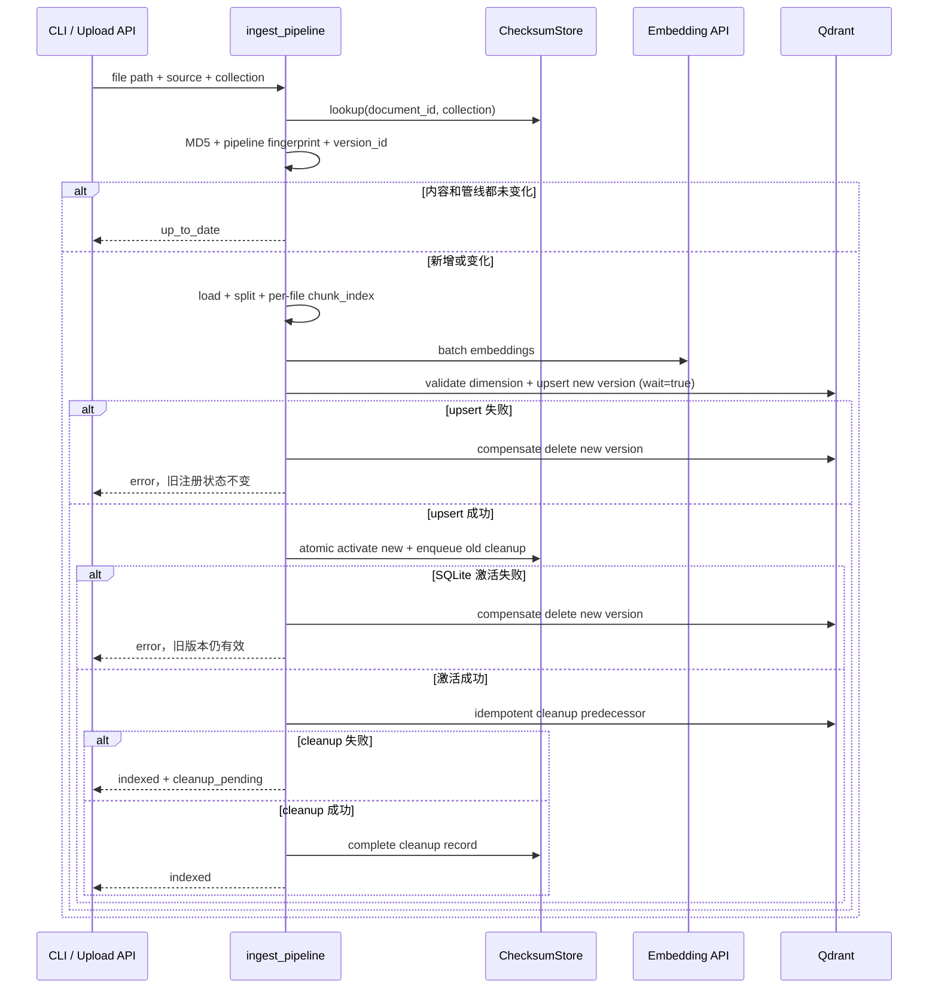
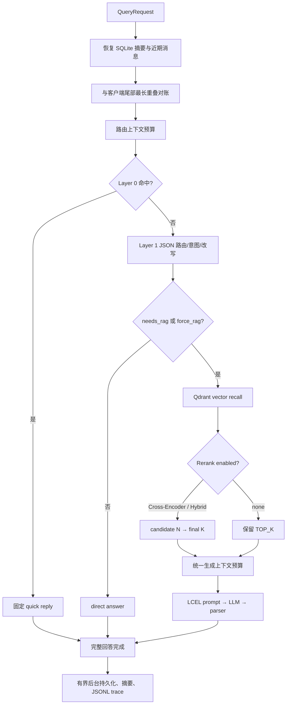

# Architecture

本文描述当前代码，而不是早期 DevLog 中已经被替换的实现。

## 1. 分层

```text
app/api/       HTTP、multipart、SSE、状态码
      ↓
app/services/  用例编排与跨模块事务边界
      ↓
app/rag/       检索、上下文、生成、摄取等领域原语
      ↓
Qdrant / SQLite / OpenAI-compatible endpoints / filesystem
```

- API 层不实现检索算法，只负责协议转换和错误映射。
- Service 层决定调用顺序，例如“先恢复记忆，再路由，再检索，再生成”。
- RAG 层中的组件尽量可单测：token 预算、evidence 匹配、reranker 和版本 ID 都可脱离真实服务验证。
- Qdrant 保存向量与 chunk payload；SQLite 分别保存文档注册状态和会话状态。

## 2. 摄取链路



### 文档身份

- 目录文件：identity key 来自规范化绝对路径。
- 上传文件：identity key 来自 Unicode NFC 规范化后的原始文件名。
- `document_id` 还包含 collection，因此同一文件在不同 collection 中互不影响。
- 上传同名文件被视为同一逻辑文档的新版本；内容也相同则删除新临时 UUID 文件并返回 `up_to_date`。
- Qdrant point ID 由 `document_id + version_id + chunk_index` 确定，重复执行同一版本是幂等 upsert。

### 管线指纹

指纹包含：

- collection；
- embedding base URL、model、人工维护的 revision；
- chunk size、overlap；
- splitter version。

它解决“文件 MD5 没变，但向量或切分语义已经变了”的漏更新问题。

### 一致性边界

Qdrant 和 SQLite 不共享事务。当前使用“新版本先同步写入 + SQLite 原子激活/清理任务 + 幂等清旧”的本地 saga：

- loader、splitter、embedding 失败：不触碰旧向量；
- 新 Qdrant 写入失败：按新 version 精确回滚；
- SQLite 激活事务失败：回滚新 Qdrant version，旧注册状态不变；
- 激活成功后才清理旧版本；失败时新版保持有效，durable cleanup queue 等待下次重试；
- 旧 UUID 上传按 Qdrant 的原 source/path 归并到新原始文件名身份；
- 目录删除只清理注册在同一个 scan root 且路径仍位于该 root 内的记录。

这比先删旧版本可靠，但仍不是跨存储 ACID。生产多节点场景应把本地清理队列迁移到共享 outbox/任务系统，并增加租约、可重试状态机和一致性巡检。

## 3. 查询链路



Layer 1 要求 JSON 输出，并兼容旧的行协议。解析失败、模型异常或缺少 direct answer 时不会贸然跳过知识库，而是使用原始问题继续 RAG。

### Rerank score 契约

召回结果先转换为：

```python
RerankCandidate(document=..., vector_score=...)
```

这样 Cross-Encoder 和 Hybrid 不再依赖易丢失的 metadata 隐式分数。Cross-Encoder 返回模型分数；Hybrid 使用归一化向量分数和关键词覆盖分数融合；失败 fallback 回到原始向量分数。

## 4. 上下文与长期记忆

模型侧记忆：

```text
rolling summary + messages after summary cursor + unpersisted client tail
```

UI 侧历史：

```text
all original messages
```

摘要只推进 `summary_through_message_id`，不删除原始消息。这样可以展示完整历史、审计摘要、改变策略后重新生成。

### 预算

路由和生成分别计算输入上限。生成阶段：

```text
input_limit
= llm_context_window
- reserved_output_tokens
- safety_margin_tokens
```

固定占用包含 system prompt、当前问题和消息协议估算。剩余预算在摘要、近期原文和按相关性排序的文档之间分配。最终还会渲染完整 prompt 再检查一次，避免各部分独立计数的边界误差。

### 超限策略

1. 不截断当前问题；
2. 从最新消息向前保留；
3. 最新单条消息过长时保留头尾；
4. 文档按排名装入，最后一块可截断；
5. 仍无法容纳则抛出 `ContextWindowExceededError`。

同步接口映射为 413；SSE 因响应已开始，使用 error event。

## 5. SSE 与异步边界

`query_rag_stream()` 是 async generator，但 SQLite 恢复、路由模型、Qdrant 检索、Rerank 和上下文规划中可能包含同步阻塞工作。这些阶段通过 `asyncio.to_thread` 移出事件循环。

事件序列：

```text
正常: routing → status* → token* → sources → done
失败: [routing] → [status*] → error → done
取消: 重新抛出 CancelledError，不落库
```

direct answer 使用固定字符切片，而不是 `split()`，因此中文、换行和连续空格不会被破坏。

生成结束后才调度副作用：

- 保存 user/assistant 完整 exchange；
- 使用 request ID 作为 `turn_id`；同一请求或重试复用该 ID 时，通过唯一索引避免重复写；
- 需要时压缩长期记忆；
- 将 query、routing、retrieval、answer 和阶段耗时写入 JSONL。

后台执行器有固定 worker 和有界队列；容量耗尽时拒绝任务并记录错误，而不是无限创建线程或无限堆积内存。应用关闭时 drain 已接收任务。

## 6. 数据存储

### `data/ingestion_state.db`

`document_registry` 是权威表，主要字段：

```text
document_id, collection_name, identity_key, source, stored_path,
content_md5, pipeline_fingerprint, version_id, chunk_count,
origin, scan_root, last_ingested_at
```

旧 `file_checksums` 表保留为兼容镜像，启动时可迁移旧数据。

### `data/conversations.db`

```text
conversations:
  id, title, summary, summary_through_message_id, created_at, updated_at

messages:
  id, conversation_id, role, content, sources, routing, turn_id, created_at
```

SQLite 使用 WAL、busy timeout、外键和同会话条带锁。消息读取按自增 ID 排序，exchange 写入使用事务。

### Qdrant payload

```text
page_content
metadata:
  document_id, version_id, source, stored_path, file_path,
  file_name, file_type, chunk_index, md5, pipeline_fingerprint,
  page / markdown headings ...
```

## 7. 进程内缓存

- Embedding query cache：256 条真正的 LRU，key 包含 base URL、model 和原文的 SHA-256。
- Embedding model client、QdrantVectorStore 和 Qdrant retrieval client 按有效配置复用。
- Cross-Encoder 首次使用时懒加载。
- tokenizer encoding 使用 `lru_cache`。

这些缓存是单进程的，重启即失效，也不会跨多个 worker 共享。

## 8. 安全边界

- 源码和 `.env.example` 不含真实云密钥；
- cloud provider 被选择但 key 为空时，配置启动即失败；
- CORS allowlist 可配置；
- 可选 `X-API-Key` 使用恒定时间比较；
- 上传按流式字节数限制，并检查 PDF magic、DOCX zip 结构、文本 UTF-8；
- 上传文件使用 UUID 存储，删除函数拒绝 `data/raw` 外路径；
- conversation ID 和请求体有长度/字符约束；
- prompt 明确把历史和检索文档视为不可信数据。

剩余风险：API Key 不是用户认证体系，RAG 文档仍可能包含间接 prompt injection，Markdown 链接策略和文件解析器还需要持续安全审查。

## 9. 评估语义

`evidence-label-v2` 把 golden evidence 作为稳定评估单位，而不是把“成功映射到的 chunk”反向当作分母。

- Recall：命中的唯一 evidence / 全部 golden evidence；
- Precision：前 K 个槽位中首次提供新 evidence 的槽位 / K；
- MRR：首个相关槽位倒数；
- NDCG：保留噪声和重复槽位的真实排名；
- context quality：仍从 chunk 角度统计无关和重复。

报告的 provenance 用 dataset hash、Git 状态和 settings fingerprint 防止把不同数据或配置误当作同一实验。旧指标语义报告不会进入 Notebook 的新策略对比。

## 10. 扩展方向

如果从当前单节点项目演进：

1. 文档 catalog 独立于 Qdrant，提供分页和状态机；
2. SQLite 迁移到 PostgreSQL，后台副作用迁移到可靠队列；
3. 增加 BM25/sparse 与 dense 双路召回，再做融合；
4. 使用模型原生 tokenizer，并评估摘要事实保留；
5. 接入 OpenTelemetry/Prometheus、trace backend 和告警；
6. 增加真实依赖集成、浏览器 E2E、并发压测和故障注入；
7. 再引入用户、租户、RBAC、限流和审计策略。
